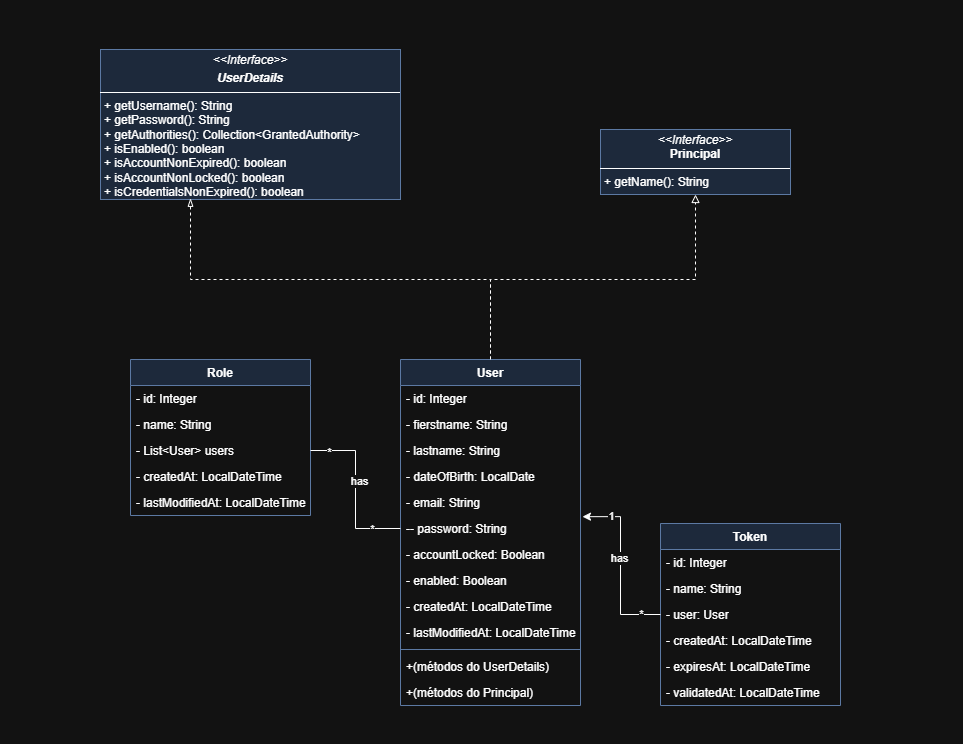
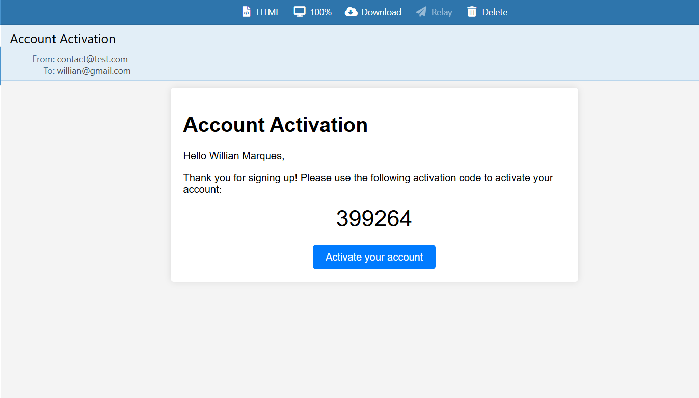

# 📧 Email Validation and Authentication API

Este projeto é uma API REST construída com **Spring Boot** que fornece funcionalidades de **autenticação de usuários com validação de e-mail** via código e token **JWT** para acesso autenticado.

---

## 🛠️ Tecnologias Utilizadas

- Java 17+
- Spring Boot (Web, Security, Validation, JPA)
- Spring Mail + Thymeleaf para e-mails HTML
- Spring Data JPA + H2/PostgreSQL
- JWT (via JJWT)
- Lombok
- OpenAPI/Swagger (via `@Tag`)
- Maven

---

## 🚀 Funcionalidades

- ✅ Registro de usuários com confirmação via e-mail
- ✅ Geração e envio de código de ativação por e-mail
- ✅ Login com autenticação JWT
- ✅ Validação de token JWT em cada requisição
- ✅ Sistema de roles para controle de permissões (ex: `ROLE_USER`)
- ✅ Expiração e reenvio automático de token de ativação

---

## 🔒 Fluxo de Ativação de Conta

1. O usuário acessa o endpoint `POST /auth/register` enviando nome, e-mail e senha.
2. A API cria um novo usuário no banco de dados com a conta **desativada**.
3. É gerado um **código de ativação** numérico de 6 dígitos.
4. Um e-mail é enviado ao usuário com:
    - O código de ativação.
    - Um link com o token no parâmetro: 
      - `GET /auth/activate-account?token=XXXXX`.
5. O usuário envia o token recebido.
6. A API valida se o token:
    - Existe.
    - Ainda está dentro do prazo de expiração (15 minutos).
7. Se **for válido**, a conta é ativada e o token é marcado como validado.
8. Se o token **estiver expirado** ou **já tiver sido utilizado**, a API:
    - Gera um novo token.
    - Envia automaticamente um novo e-mail com o novo código de ativação.
    - Retorna uma mensagem informando que um novo foi enviado.
9. A partir do momento em que a conta é ativada, o usuário pode fazer login via 
    - `POST /auth/authenticate`.
10. Um token JWT será enviado para ser usado nas próximas requisições. 

---

## 📦 Estrutura Principal

### 🔐 Autenticação

#### `AuthenticationController`

Controlador responsável pelos endpoints:

- `POST /auth/register`: Cadastro de usuário com envio de e-mail de ativação
- `POST /auth/authenticate`: Login com geração de token JWT
- `GET /auth/activate-account?token=xxx`: Ativação da conta via código recebido no e-mail

#### `AuthenticationService`

Contém a lógica de:

- Registro de usuários com role padrão
- Geração de token de ativação com expiração
- Envio de e-mail com código
- Validação de token e ativação da conta
- Login e geração de JWT com authorities

---

### ✉️ Envio de E-mail

#### `EmailService`

Serviço responsável por:

- Enviar e-mails HTML com templates Thymeleaf
- Suporte assíncrono via `@Async`
- Substituição de variáveis no HTML (`username`, `activation_code`, `confirmationUrl`)

#### `EmailTemplate`

Enum com templates disponíveis (ex: `ACTIVATE_ACCOUNT`)

---

### 🔐 JWT

#### `JwtService`

Responsável por:

- Geração e assinatura de tokens JWT
- Extração de claims (usuário, data, permissões)
- Validação de tokens

#### `JwtFilter`

Filtro que intercepta as requisições e:

- Extrai e valida o token
- Define a autenticação no contexto de segurança

---

### 👤 Usuário, Token e Role

- **`User`**: Entidade principal de usuários, implementa `UserDetails`
- **`Token`**: Token de ativação com campos `createdAt`, `expiresAt`, `validatedAt`
- **`Role`**: Papel do usuário no sistema (ex: `ROLE_USER`, `ROLE_ADMIN`)

---

---

## 📂 Templates de E-mail

Localizados na pasta de recursos (`resources/templates`), utilizam Thymeleaf para renderização dinâmica:

- **`activate_account.html`**: contém:
    - Código de ativação
    - Link direto de ativação

---

---